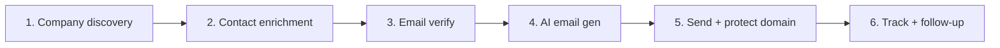
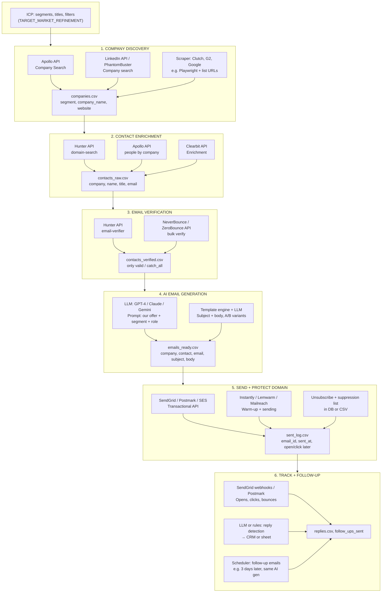
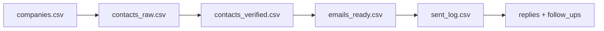

# Leads Gen Flow — Fully Automated (AI + Tools)

**To view the diagrams:** open **`LEADS_GEN_FLOW.html`** in your browser (right-click the file in Cursor → **Reveal in File Explorer** → double-click the HTML, or drag it into Chrome/Edge).

End-to-end flow with **no manual work**. Each step uses a selected tool or AI; data flows from one step to the next.

---

## High-level flow

---

## Full process diagram (tools at each step)

---

## Tool selection table (per step)

| Step | Purpose | Tool options | Output |
|------|---------|--------------|--------|
| **1. Company discovery** | Get company names + websites by segment | **Apollo API** (company search), **PhantomBuster** / **LinkedIn** (company search), **Playwright** (scrape Clutch/G2/Google) | `companies.csv`: segment, company_name, website |
| **2. Contact enrichment** | Get decision-maker name, title, email per company | **Hunter API** (domain-search), **Apollo API** (people by company), **Clearbit** (enrichment) | `contacts_raw.csv`: company, name, title, email |
| **3. Email verification** | Remove invalid / risky emails | **Hunter** (email-verifier), **NeverBounce**, **ZeroBounce** | `contacts_verified.csv`: only valid/catch_all |
| **4. AI email generation** | Personalized subject + body per contact | **OpenAI / Anthropic / Google** (GPT-4, Claude, Gemini) + prompt (our offer, segment, role) | `emails_ready.csv`: contact, email, subject, body |
| **5. Send + protect domain** | Send without burning domain | **SendGrid**, **Postmark**, **SES** + **Instantly** / **Lemwarm** (warm-up); **suppression list** in DB/CSV | `sent_log.csv`: email_id, sent_at |
| **6. Track + follow-up** | Opens, clicks, replies; auto follow-up | **SendGrid/Postmark webhooks**; **LLM or rules** for reply detection; **scheduler** for follow-up (same AI gen) | `replies.csv`, follow-up sends |

---

## Data flow (no manual handoffs)

- **Script 1:** ICP + APIs/scrape → `companies.csv`
- **Script 2:** `companies.csv` + Hunter/Apollo/Clearbit → `contacts_raw.csv`
- **Script 3:** `contacts_raw.csv` + Hunter/NeverBounce → `contacts_verified.csv`
- **Script 4:** `contacts_verified.csv` + LLM → `emails_ready.csv`
- **Script 5:** `emails_ready.csv` + SendGrid/Postmark + warm-up → send; write `sent_log.csv`
- **Script 6:** Webhooks + reply detection → `replies.csv`; scheduler + LLM → follow-up emails

Everything is API → CSV/DB → next script. No copy-paste.

---

## Recommended tool stack (single choice per step)

| Step | Recommended tool | Why |
|------|------------------|-----|
| 1. Company discovery | **Apollo API** | One API for company search + filters; exports name + domain. |
| 2. Contact enrichment | **Hunter API** or **Apollo API** | Hunter: domain → people. Apollo: company → people. Pick one for consistency. |
| 3. Email verification | **Hunter** (same key as step 2) or **NeverBounce** | Hunter: same account. NeverBounce: strong bulk + deliverability. |
| 4. AI email gen | **OpenAI API** (GPT-4) or **Anthropic** (Claude) | Simple prompt: “Our offer: X. Segment: Y. Role: Z. Write short cold email.” |
| 5. Send + protect | **SendGrid** + **Instantly** (warm-up) or **Instantly** only (has sending + warm-up) | SendGrid: reliable. Instantly: warm-up + sending in one. |
| 6. Track + follow-up | **SendGrid webhooks** + **Cron/scheduler** + same **LLM** for follow-up copy | Webhooks → opens/clicks/bounces; scheduler runs “follow-up” script with same AI. |

---

## Implementation order

1. **Script 1:** Apollo company search → `companies.csv` (or Hunter-only flow: you still need a company list; Apollo or scrape).
2. **Script 2:** `companies.csv` → Hunter (or Apollo) → `contacts_raw.csv` (already have `find_emails.py`; wire it to read from script 1 output).
3. **Script 3:** Verify step inside script 2 or separate; output `contacts_verified.csv`.
4. **Script 4:** Read verified contacts → call LLM per row → `emails_ready.csv`.
5. **Script 5:** Read `emails_ready.csv` → send via SendGrid/Instantly; log to `sent_log.csv`; respect warm-up + caps.
6. **Script 6:** Webhooks → update status; reply detection → `replies.csv`; cron + LLM → follow-up emails.

This is the full automated leads gen flow with tool selection at each point and no manual work.
